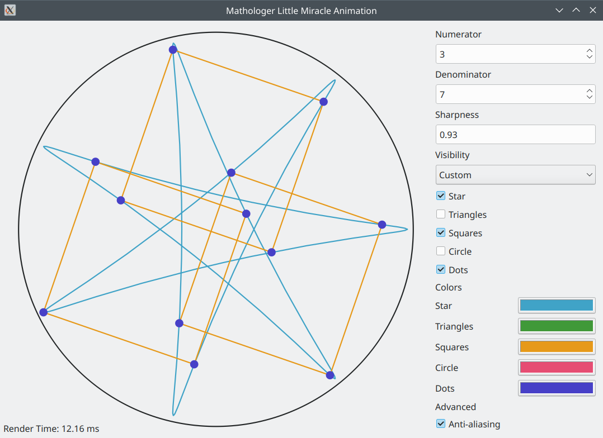

# Little Miracle

This is an animation program inspired by Mathologer's [3-4-7 miracle video](https://www.youtube.com/watch?v=oEN0o9ZGmOM).

# Installation

## Windows

[Little Miracle 1.0](https://github.com/sorokin/littlemiracle/releases/download/1.0/littlemiracle-1.0-win10-x64.zip) is available for downloading. It requires Windows 10 (1809 or later; 64-bit).

## Linux

One can compile the program by running

    $ git clone https://github.com/sorokin/littlemiracle.git
    $ cd littlemiracle
    $ cmake -DCMAKE_BUILD_TYPE=RelWithDebInfo .
    $ make
    $ ./littlemiracle

# Try online

[Online demo](https://sorokin.github.io/littlemiracle/littlemiracle.html) is available. The web version has some limitations:

* Rendering is approximatelly 4 times slower than on desktop. This might be problematic when anti-aliasing is enabled. Also the problem is exacerbated by the fact that program doesn't use `requestAnimationFrame`.
* Color selection requires showing the color selection dialog and the web version doesn't support dialogs.
* Copy image to clipboard menu item is not available.
* Tooltips are disabled.
* The focus doesn't return to the control after context menu is shown.

For best experience please use desktop version.
